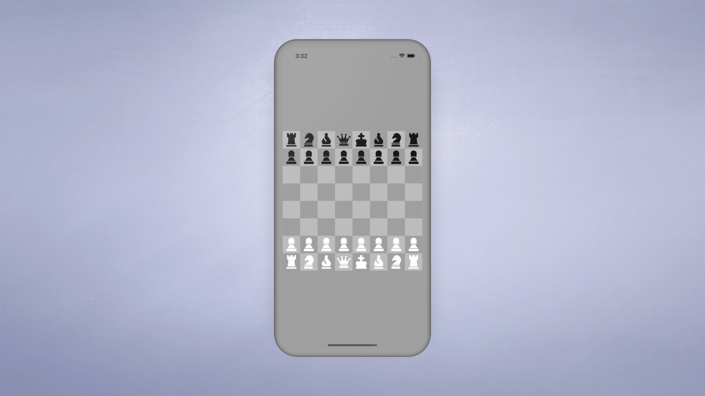

# Chess Flutter App

Welcome to our Chess Flutter App repository! This project is a fully functional chess game, developed using Flutter. It allows you to play a classic game of chess on your device with an easy-to-use and aesthetically pleasing interface.

## Overview

Our chess game offers a smooth and immersive gameplay experience. It contains all the rules and functionalities of a standard chess game, so you can enjoy a realistic match. The application's main goal is to allow users to enjoy chess in a digital environment while maintaining the authenticity and complexity of the game.

This app is designed to cater to everyone, from beginners to expert players. New players can take advantage of this app to learn the game and practice, while advanced players can use it to hone their skills.

### Features

- **Interactive Chessboard**: The game has an 8x8 grid representing the chessboard. Each square on the board is interactive, allowing players to make moves by tapping on the chess pieces and then the destination square.

- **Valid Move Highlights**: The app automatically highlights all valid moves for a selected piece, aiding players in strategizing their next move.

- **Check and Checkmate Detection**: The app can recognize both 'check' and 'checkmate' situations, notifying players when their king is under threat or when the game is over.

- **Captured Pieces Display**: All captured pieces are displayed on the screen, giving players an overview of the pieces taken by both sides.

- **Turn Indication**: The app indicates whose turn it is, helping players keep track of the game flow.

- **Reset Game**: There is a feature to reset the game, allowing players to start over at any time.

We hope you enjoy this chess game! Happy gaming!
